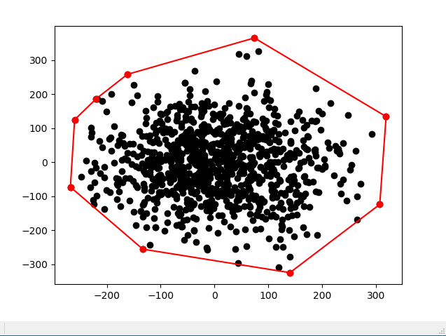

# Computational Geometry

This repository contains some code experiments I did for fun as an exercise in learning computational geometry, C++, CMake and the CGAL computational geometry libraries.

---

## Convex Hulls

This algorithm computes the convex hull of a set of points, which is defined as the polygon that contains all of the points within a set.

Here are a few things this project does:
> - exports the main runtime function from the C++ DLL to be name accessible (not C++ mangled)
> - uses the Python ctypes module to create Python bindings for the C++ function
> - encodes the data as a custom JSON type that is shared between Python and a custom C++ library. This was just for creating a shared data interface for testing and development but is definitely not the best method for high-performance. Encoding the data as custom ctypes structs and passing them as pointers to the C++ DLL is much much faster, but requires more boiler plate code for each test
> - Python script generates a random set of 2D points and then calls the DLL convex hull function
> - performance is substantially higher than a native Python implementation due to the speed of C++. It even comes fairly close to matching the performance of the highly optimized Scipy implementation

